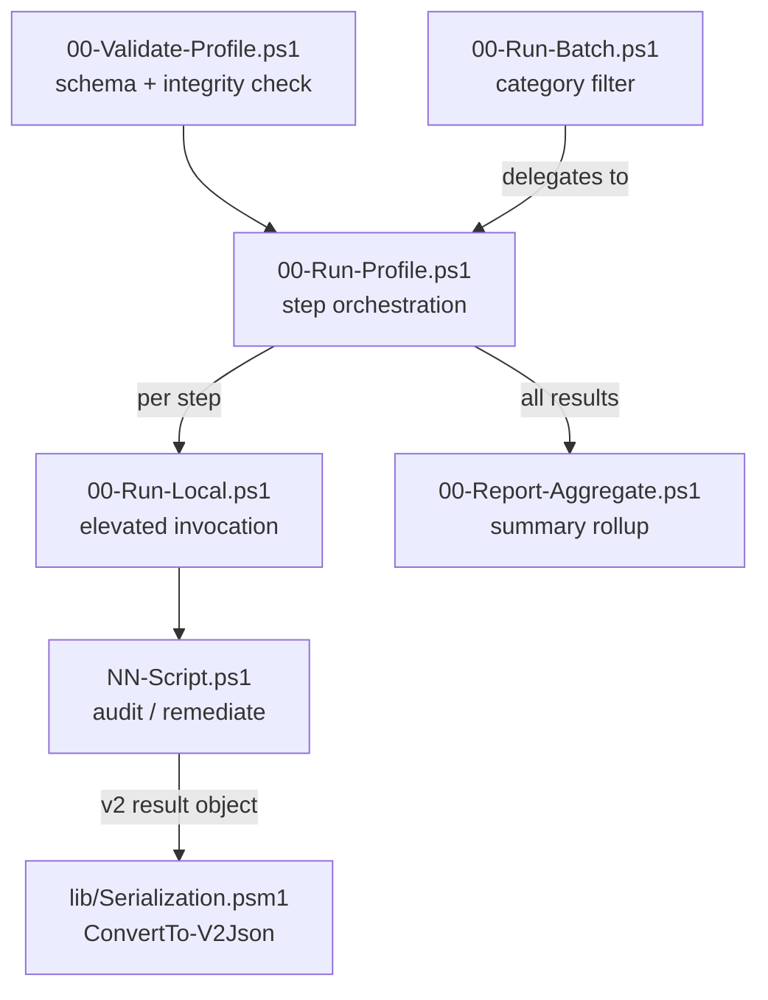

# Windows MDM Endpoint Security Hardening Kit

[](https://github.com/sebastianspicker/win-mdm-security-hardening-kit/actions/workflows/ci.yml)
[](https://app.codacy.com/gh/sebastianspicker/win-mdm-security-hardening-kit/dashboard?utm_source=gh&utm_medium=referral&utm_content=&utm_campaign=Badge_grade)
[](https://securityscorecards.dev/viewer/?uri=github.com/sebastianspicker/win-mdm-security-hardening-kit)
[](https://www.bestpractices.dev/projects/13161)

PowerShell toolkit for Windows endpoint hardening, drift detection, triage, and controlled remediation in MDM-managed environments.

## Quick Start

Run from an elevated PowerShell prompt:

```powershell
# Defender health check (audit mode, no changes)
.\scripts\27-Defender-Health-Audit.ps1

# Structured JSON output
.\scripts\27-Defender-Health-Audit.ps1 -PassThru | ConvertTo-Json -Depth 6

# Run multiple scripts from a profile
.\scripts\00-Run-Profile.ps1 -ProfilePath .\examples\profiles\rapid-triage.json
```

## What This Repo Does

- Audits Windows endpoint posture across Defender, firewall, BitLocker, Credential Guard, AppLocker, PowerShell logging, update health, remote access, and related areas.
- Runs individual operational scripts or ordered profile workflows.
- Produces human-readable console output and structured v2 result objects for automation.
- Supports controlled remediation only where scripts explicitly implement `-Mode Remediate` and PowerShell `ShouldProcess` behavior.

Windows runtime behavior should be validated on a lab host before production rollout. Cross-platform development checks cover parsing, orchestration contracts, and tests.

## Repository Structure

- `scripts/` - operational scripts and v2 orchestration entry points
- `lib/` - shared PowerShell modules
- `examples/` - sample config and profile JSON
- `docs/` - public documentation index and assets
- `tests/` - Pester and fuzz tests
- `tools/` - developer and operator utilities
- `.github/` - workflows, templates, and repository policy metadata

## Orchestration Model

The v2 runner layer keeps profile validation, script selection, integrity checks, and result export in one path:

- `scripts/00-Validate-Profile.ps1` validates profile JSON.
- `scripts/00-Run-Profile.ps1` executes ordered profile steps.
- `scripts/00-Run-Batch.ps1` runs category-based batches.
- `scripts/00-Report-Aggregate.ps1` aggregates JSON outputs.
- `scripts/00-Run-Local.ps1` invokes an individual script through the runner path.



## Profile Schema

Profiles in `examples/profiles/*.json` use these main fields:

- `ProfileName`
- `Version`
- `Defaults`
- `Mode` (`Audit` or `Remediate`)
- `Strict`
- `OutputFormat` (`Console`, `Json`, `Csv`, or `None`)
- `OutputPath`
- `Steps[]`
- `Script`
- `Args`
- `ContinueOnError`
- `DependsOn`
- `Integrity`
- `RequireSigned`
- `ExpectedHashes`

Profile input is untrusted run input. Profile steps must not override runner-owned path, integrity, or confirmation controls.

## Local Validation

From the repository root:

```powershell
# Validate an orchestration profile before execution
pwsh -NoProfile -File .\scripts\00-Validate-Profile.ps1 -ProfilePath .\examples\profiles\baseline-audit.json

# Smoke-test the documented baseline audit profile
pwsh -NoProfile -File .\scripts\00-Run-Profile.ps1 -ProfilePath .\examples\profiles\baseline-audit.json -Mode Audit -OutputFormat None -Confirm:$false

# Parse checks only
pwsh -NoProfile -ExecutionPolicy Bypass -File .\tools\verify.ps1 -SkipAnalyzer

# Parse checks plus PSScriptAnalyzer
pwsh -NoProfile -ExecutionPolicy Bypass -File .\tools\verify.ps1

# Secret scan
pwsh -NoProfile -ExecutionPolicy Bypass -File .\tools\secret-scan.ps1

# Pester tests
pwsh -NoProfile -Command "Invoke-Pester -Path .\tests -Output Detailed"
```

Cross-platform wrapper:

```bash
./scripts/ci-local.sh
```

On non-Windows developer hosts, orchestration-level verification is supported with PowerShell 7. Windows-only numbered scripts should return a structured unsupported-host result instead of aborting profile startup.

## Launcher GUI

Run the launcher from the repository root:

```powershell
pwsh -ExecutionPolicy Bypass -File .\tools\Launcher-GUI.ps1
```

The launcher supports single-script runs, profile runs, argument presets, live output, and saving an output log.


## Console Output

Scripts use consistent status prefixes for scannable results:

- `[OK]` / `[PASS]` - check passed, compliant
- `[WARN]` / `[MED]` - drift detected, review recommended
- `[FAIL]` / `[HIGH]` / `[CRIT]` - non-compliant, action required
- `[INFO]` / `[SKIP]` - informational or skipped

Shared `Output.psm1` helpers write capture-friendly information-stream text. Scripts that import `Console.psm1` additionally render host-colored summaries.

## Security Notes

- Validate all remediation flows in a lab before production.
- Prefer `-WhatIf` and `-Confirm` when supported.
- Use script signing or expected hash checks in deployment pipelines.
- Treat generated evidence exports as sensitive.

Runner integrity checks may accept only `SHA256`, `SHA384`, or `SHA512`; keep regression coverage for inline `ExpectedHash` algorithm parsing.

## Documentation Policy

Public docs describe the current supported project surface. Keep durable guidance in:

- `README.md`
- `CONTRIBUTING.md`
- `SECURITY.md`
- `CHANGELOG.md`
- `docs/README.md`
- `scripts/README.md`
- `lib/README.md`
- `examples/README.md`

Do not commit internal audit notes, remediation plans, ledgers, status logs, agent instructions, generated evidence, local archive packets, local analysis artifacts, vendored source snapshots, or machine-specific workspace state.

## Related Docs

- [Documentation index](docs/README.md)
- [Script catalog](scripts/README.md)
- [Shared module reference](lib/README.md)
- [Examples](examples/README.md)
- [Security policy](SECURITY.md)
