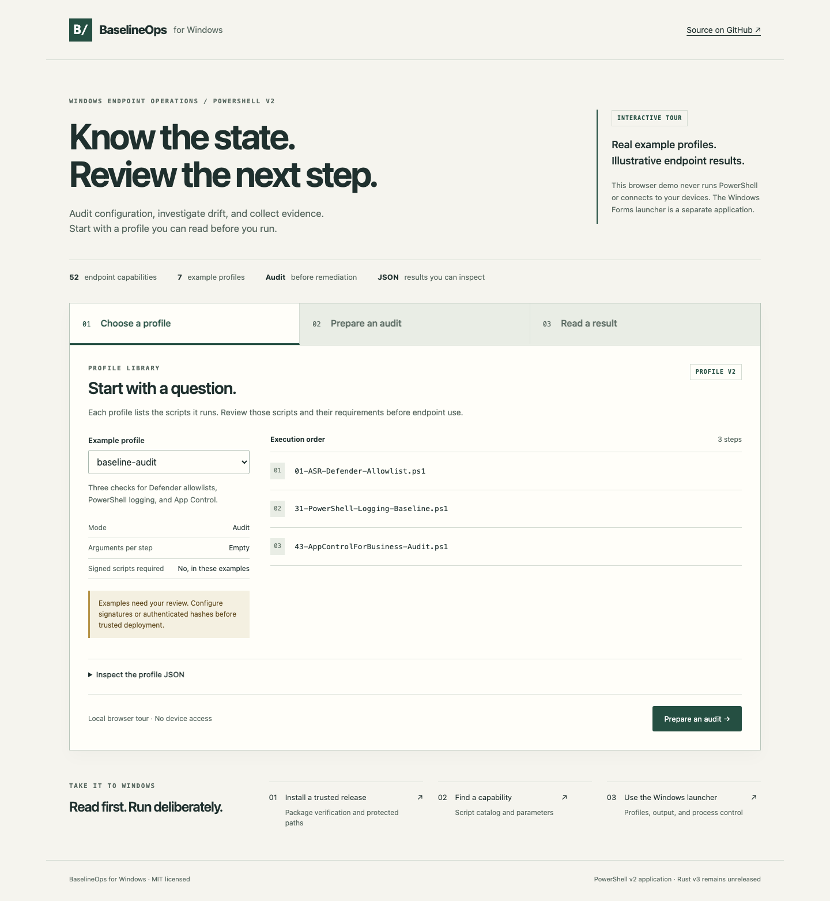
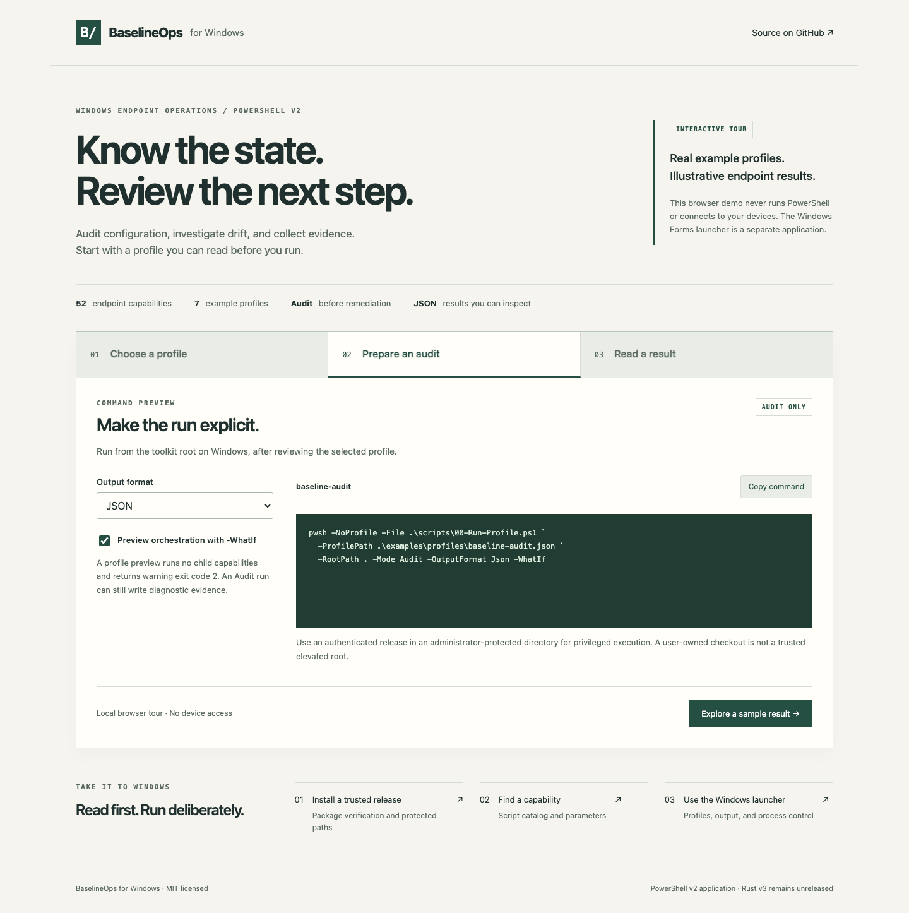
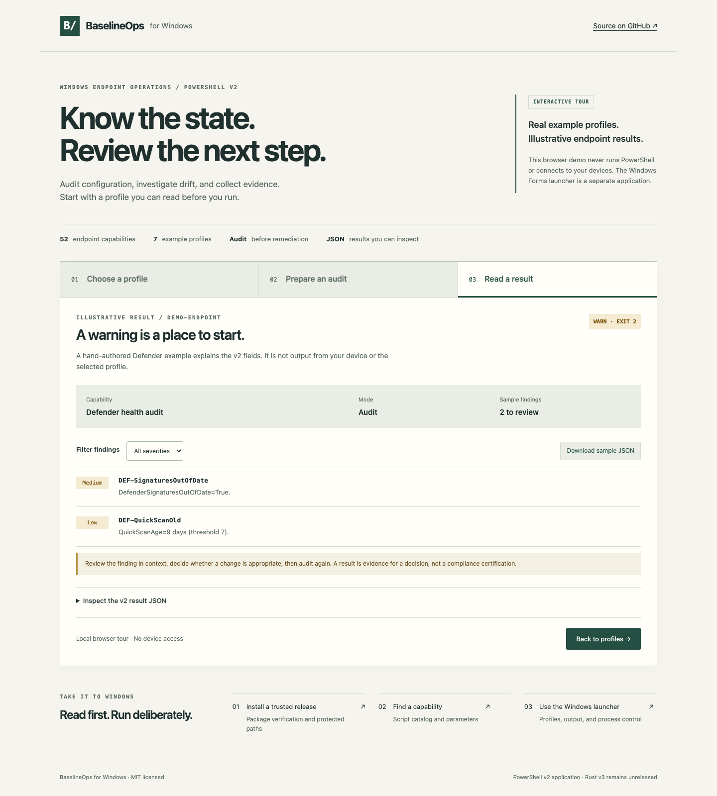

# BaselineOps for Windows

BaselineOps is a PowerShell toolkit for auditing Windows endpoints,
investigating configuration drift, and collecting diagnostic evidence. It
includes 52 endpoint capabilities, reusable profiles, and an optional Windows
Forms launcher. Some capabilities can also change settings, with explicit
remediation and confirmation controls.

Use it directly on Windows or through your existing device-management workflow.
No particular MDM service, domain, or organization is required; individual
checks depend on the Windows features they inspect.

The supported application is PowerShell v2, distributed as a set of files.
An unreleased [Rust v3 implementation](https://github.com/sebastianspicker/baseline-ops/blob/main/rust/README.md)
is also in development. Each has its own tests and releases; neither requires
or calls the other at runtime.

[Get started](#get-started) · [Script catalog](scripts/README.md) ·
[Screenshot tour](#screenshot-tour) · [Documentation](docs/README.md) ·
[Live demo](https://sebastianspicker.github.io/baseline-ops/)

## Capabilities

- 52 numbered endpoint capabilities covering Defender, firewall, BitLocker,
  LAPS, Windows Update, WinGet, Sysmon, remote access, event logs, identity,
  storage, backup readiness, and related Windows state
- six `00-*` scripts to validate profiles, run individual capabilities or
  groups of them, synchronize a deployment, and combine results
- audit, evidence collection, monitoring, and selected remediation operations
- consistent v2 results for console, JSON, CSV, and pipeline output
- seven reviewed example profiles and four script-specific JSON examples
- an optional Windows Forms launcher for scripts and profiles

The [script catalog](scripts/README.md) is the complete capability and parameter
index.

## Requirements

- Windows with the APIs and features required by the selected capability
- PowerShell 7.6.3 or Windows PowerShell 5.1
- administrator rights for most remediation and some audit operations
- script-specific components such as Defender, BitLocker, WinGet, or Sysmon

The launcher additionally requires Windows Forms and either Windows PowerShell
5.1 with .NET Framework 4.8 or PowerShell 7.6.3. Remediation selection requires
an elevated launcher.

Development uses PowerShell 7.6.3, PSScriptAnalyzer 1.25.0, Pester 5.8.0, and
Bash. Rust v3 uses the toolchain pinned in
[`rust/rust-toolchain.toml`](https://github.com/sebastianspicker/baseline-ops/blob/main/rust/rust-toolchain.toml), currently Rust 1.96.0.

## Get started

For privileged endpoint use, follow the
[release and protected-install guide](docs/alpha-release.md). The source files
are unsigned; review the guide before running them as administrator.

For development or standard-user inspection, clone the repository:

```powershell
git clone https://github.com/sebastianspicker/baseline-ops.git baselineops-windows
Set-Location -LiteralPath .\baselineops-windows
```

Run a read-only Defender health audit:

```powershell
.\scripts\27-Defender-Health-Audit.ps1
```

Validate and run the baseline audit profile from the repository root:

```powershell
pwsh -NoProfile -File .\scripts\00-Validate-Profile.ps1 `
  -ProfilePath .\examples\profiles\baseline-audit.json -RootPath .

pwsh -NoProfile -File .\scripts\00-Run-Profile.ps1 `
  -ProfilePath .\examples\profiles\baseline-audit.json `
  -RootPath . -Mode Audit -OutputFormat None -Confirm:$false
```

Use `Get-Help .\scripts\<name>.ps1 -Full` before operating an unfamiliar
capability. Run privileged code only from an authenticated release installed in
an administrator-protected directory; a checkout or Downloads extraction is
not a trusted elevated execution root. Follow the
[release and protected-install guide](docs/alpha-release.md).

## Screenshot tour

Explore the [interactive browser demo](https://sebastianspicker.github.io/baseline-ops/) without a Windows device.
The screenshots below show that browser tour, using repository example
profiles and fictional results. It does not run PowerShell or reproduce the
native Windows Forms launcher.

### 1. Choose a profile

Inspect the scripts and their execution order before running a profile.
The tour includes baseline audit, endpoint health, and rapid triage examples.



### 2. Prepare an audit

Choose an output format and copy an Audit command. Enable `-WhatIf` to preview
orchestration without running child capabilities.



### 3. Read the findings

Filter a sample Defender result by severity, inspect its v2 JSON, and download
the sample. A warning calls for review; it does not certify compliance.



## Execution and configuration

Run a capability directly, through `00-Run-Local.ps1`, or from the launcher.
Use a v2 profile or a curated batch to run several capabilities in order.
Profiles select scripts and dependencies. They cannot authorize arbitrary
executables or arguments, choose privileged output paths, or enable remediation.

Start with the reviewed files in [`examples/`](examples/README.md):

- `examples/profiles/` contains complete v2 orchestration profiles.
- `examples/configs/` contains direct inputs for four named capabilities.

Profile constraints:

- `Steps[].Args` must be empty.
- `Defaults.Mode` cannot activate remediation; the trusted runner command must
  include `-Mode Remediate`.
- `Defaults.OutputFormat` and `Defaults.OutputPath` are validated but ignored by
  the runner; use runner parameters for output.
- `-WhatIf` on a profile or batch previews orchestration without running child
  capabilities and returns warning exit code `2`.

The examples are not production policy. Copy and review them before use.

## Results and operational safety

Scripts that support the runners return these v2 fields: `SchemaVersion`,
`ScriptName`, `Mode`, `ComputerName`, `TimestampUtc`, `Result`, `Findings`,
`Summary`, and `Metadata`.

| Exit | Meaning |
| --- | --- |
| `0` | Completed with result `OK` |
| `1` | Failed with result `FAIL` |
| `2` | Completed with result `WARN`; review findings |

`-OutputFormat` accepts `Console`, `Json`, `Csv`, or `None`. Use JSON to
preserve every result field. Depending on its parameters, a script can write
reports, archives, logs, or other evidence even in Audit mode.

Before running on an endpoint:

- start in Audit mode on a disposable device;
- review all inputs, output paths, privileges, reboot effects, and rollback;
- use `-WhatIf` for state-changing capabilities that implement
  `ShouldProcess`;
- keep privileged output locations in trusted directories that untrusted users
  cannot replace or redirect;
- rerun Audit after remediation; stopping a process does not undo completed
  changes;
- protect results, launcher logs, support bundles, and test XML as sensitive
  endpoint data.

The source files are not Authenticode-signed. A valid Authenticode status alone
does not identify the BaselineOps release publisher; deployment policy must
supply the trusted signer identity or authenticated hashes. See
[`SECURITY.md`](SECURITY.md) for the complete trust and reporting policy.

## Repository structure

| Path | What belongs here |
| --- | --- |
| `scripts/00-*` | Public orchestration and deployment scripts |
| `scripts/01-*` to `52-*` | Public endpoint capabilities |
| `scripts/internal/` | Helpers private to individual capabilities |
| `scripts/_lib/` | Internal runner bootstrap |
| `lib/` | Shared PowerShell modules |
| `lib/platform/` | Private Windows and native-process implementation |
| `tools/Launcher-*` | Windows Forms launcher and its separate worker process |
| `tests/` | Development tests for behavior, compatibility, and security checks |
| `examples/` | Profiles and capability inputs to review before use |
| `rust/` | Unreleased v3 implementation with its own builds and releases |

See the [architecture document](docs/architecture.md) for dependency direction,
runtime flows, public contracts, and trust boundaries.

## Development and verification

Install the pinned PowerShell development modules when absent:

```powershell
Install-Module PSScriptAnalyzer -RequiredVersion 1.25.0 -Scope CurrentUser
Install-Module Pester -RequiredVersion 5.8.0 -Scope CurrentUser -SkipPublisherCheck
```

Run the complete PowerShell 7 local gate from the repository root:

```bash
bash ./scripts/ci-local.sh
```

The wrapper requires PowerShell 7.6.3 and runs code-quality checks, the secret
scan, documentation checks, static verification, and Pester. Set `PWSH_BIN` to an
absolute 7.6.3 executable when `pwsh` is not on `PATH`:

```bash
PWSH_BIN='/absolute/path/to/pwsh' bash ./scripts/ci-local.sh
```

Windows PowerShell 5.1, LocalSystem, protected installations, extracted
packages, and Windows features need their own CI or lab checks. Passing tests
on another operating system does not verify those environments.

Run the Rust v3 checks separately from `rust/`:

```bash
cargo fmt --all --check
cargo clippy --workspace --all-targets --all-features -- -D warnings
cargo test --workspace --all-features
RUSTDOCFLAGS='-D warnings' cargo doc --workspace --all-features --no-deps
cargo run -p xtask -- generate
cargo run -p xtask -- verify
cargo deny check
```

Passing these checks does not show that Rust matches every PowerShell
capability or is ready for release.

Read [`CONTRIBUTING.md`](CONTRIBUTING.md) for the source, test, review, and
documentation workflow.

## Documentation

Use the [documentation index](docs/README.md) to find operator guides,
reference material, contributor instructions, and Rust development status.

BaselineOps for Windows is licensed under the [MIT License](LICENSE).
