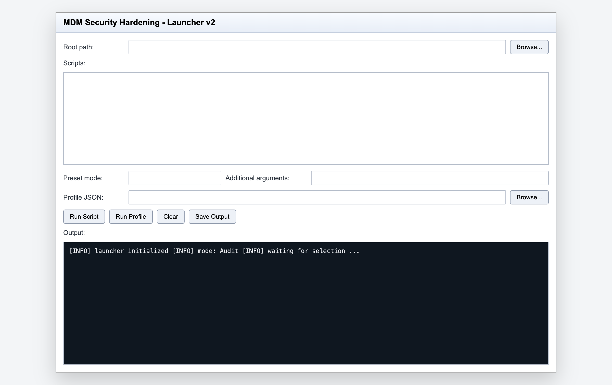

# Windows MDM Endpoint Security Hardening Kit

[](https://github.com/sebastianspicker/win-mdm-security-hardening-kit/actions/workflows/ci.yml)
[](https://securityscorecards.dev/viewer/?uri=github.com/sebastianspicker/win-mdm-security-hardening-kit)

PowerShell toolkit for Windows endpoint hardening, drift detection, triage, and controlled remediation in MDM-managed environments.

## Quick start

Run a single audit from an elevated PowerShell prompt:

```powershell
# Defender health check (audit mode, no changes)
.\scripts\27-Defender-Health-Audit.ps1

# Any script with structured JSON output
.\scripts\27-Defender-Health-Audit.ps1 -PassThru | ConvertTo-Json -Depth 6

# Run a profile (multiple scripts in sequence)
.\scripts\00-Run-Profile.ps1 -ProfilePath .\examples\profiles\rapid-triage.json
```

## Repository policy

This repository uses a lean root layout. The root intentionally keeps only core project docs:

- `README.md`
- `CONTRIBUTING.md`
- `SECURITY.md`
- `CHANGELOG.md`

Operational bug tracking and investigation history live in GitHub Issues/PRs, not in large root markdown artifacts.

## Requirements

- Windows 10/11 or Windows Server (script dependent)
- PowerShell 5.1+ (PowerShell 7.x supported for local dev tooling)
- Elevated shell for scripts that modify system state
- Optional components by script: Defender, BitLocker, Sysmon, WinGet

## Core structure

- `scripts/` : operational scripts (49 scripts across audit, remediation, collection, monitoring)
- `lib/` : shared modules (Output, Console, Results, Config, Registry, etc.)
- `examples/` : sample JSON configs and profiles
- `tests/` : Pester tests
- `tools/` : CI and operator utilities (GUI launcher, verify, secret scan)

## Script catalog (at a glance)

| # | Script | Category | Audit | Remediate |
|---|--------|----------|:-----:|:---------:|
| 01 | ASR-Defender-Allowlist | Defender | x | x |
| 02 | LAPS-Hygiene | Identity | x | x |
| 03 | LocalAdmins-Guardrail | Identity | x | x |
| 04 | OfficeBrowser-Hardening-Proof | Hardening | x | x |
| 05 | WUFB-Proofing | Patching | x | x |
| 06 | UpdateHealth-SSU-Proof | Patching | x | |
| 07 | ScheduledTasks-Hygiene | Hygiene | x | x |
| 08 | WinGet-SelfHeal | Utility | x | |
| 09 | SupportBundle | Collection | x | |
| 10 | SupportBundle-Parser | Collection | x | |
| 11 | IOC-Sweep-Defender | IR/Triage | x | |
| 12 | Suspicious-Artifact-Grabber | IR/Triage | x | |
| 13 | LSASS-CG-HVCI-VBS | Credential | x | x |
| 14 | SecureRemoteAccessGuardrails | Hardening | x | x |
| 15 | HardwareTPM-Audit | Hardware | x | |
| 16 | Sysmon-Config-Updater | Monitoring | x | x |
| 17 | Sysmon-Rule-Drift-Sensor | Monitoring | x | |
| 18 | Firewall-Baseline | Network | x | x |
| 19 | Software-Audit | Inventory | x | |
| 20 | MissingPatch-Notification | Patching | x | |
| 21 | EmergencyKillSwitch | IR/Triage | | x |
| 22 | SMB-Encryption-Enforcer | Network | x | x |
| 23 | BitLocker-Operations-Audit | Encryption | x | |
| 24 | Cert-AutoEnrollment-Health | PKI | x | |
| 25 | WinGet-Config-Baseline-Runner | Utility | x | |
| 26 | Get-WinEvent-FastTriage | IR/Triage | x | |
| 27 | Defender-Health-Audit | Defender | x | |
| 28 | Join-Identity-Audit | Identity | x | |
| 29 | Network-Config-Audit | Network | x | |
| 30 | Service-Process-Audit | Inventory | x | |
| 31 | PowerShell-Logging-Baseline | Logging | x | x |
| 32 | Firewall-Logging-Audit | Logging | x | |
| 33 | AdvancedAuditPolicy-Audit | Logging | x | x |
| 34 | TimeSync-Health | Health | x | |
| 35 | Storage-Reliability-Audit | Health | x | |
| 36 | Backup-Readiness-Audit | Health | x | |
| 37 | Remote-Surface-Audit | Hardening | x | |
| 38 | SecurityOptions-Drift | Compliance | x | |
| 39 | CredentialGuard-VBS-AuditRemediate | Credential | x | x |
| 40 | AddedLSAProtection-RunAsPPL-AuditRemediate | Credential | x | x |
| 41 | NTLM-Audit-Client | Identity | x | |
| 42 | Client-SecurityBaseline-Report-IntuneRef | Compliance | x | |
| 43 | AppControlForBusiness-Audit | Hardening | x | |
| 44 | Defender-Ransomware-NetworkProtection | Defender | x | x |
| 45 | WEF-Client-Forwarding-Readiness | Monitoring | x | |
| 46 | SecureBoot-UEFI-Audit | Hardware | x | |
| 47 | WDAG-Readiness-Audit | Hardening | x | |
| 48 | ExploitProtection-Audit | Hardening | x | |
| 49 | DriverSigning-Integrity-Audit | Hardening | x | |

See [scripts/README.md](scripts/README.md) for full parameter documentation per script.

## v2 execution model

New orchestration scripts provide a normalized execution layer:

- `scripts/00-Validate-Profile.ps1` : validates profile JSON
- `scripts/00-Run-Profile.ps1` : executes profile steps with dependency/order controls
- `scripts/00-Run-Batch.ps1` : runs category/tag based script batches
- `scripts/00-Report-Aggregate.ps1` : aggregates multiple JSON outputs

Deployment helpers:

- `scripts/00-Copy-Local.ps1`
- `scripts/00-Run-Local.ps1`

### Breaking changes (v2 hard cutover)

- `-Mode` is the normalized execution switch (`Audit|Remediate`) for productive scripts.
- Legacy top-level `-Remediate` parameters were removed from productive scripts.
- Legacy `AuditOnly` mode values were removed from script parameter contracts.

## Profile schema (v2)

`examples/profiles/*.json` follow this shape:

- `ProfileName`
- `Version`
- `Defaults`
  - `Mode` (`Audit` or `Remediate`)
  - `Strict`
  - `OutputFormat` (`Console|Json|Csv|None`)
  - `OutputPath`
- `Steps[]`
  - `Script`
  - `Args`
  - `ContinueOnError`
  - `DependsOn`
- `Integrity`
  - `RequireSigned`
  - `ExpectedHashes`

## Validation and local CI

From repository root:

```powershell
# Validate an orchestration profile before execution
pwsh -NoProfile -File .\scripts\00-Validate-Profile.ps1 -ProfilePath .\examples\profiles\baseline-audit.json

# Smoke the documented baseline audit profile
pwsh -NoProfile -File .\scripts\00-Run-Profile.ps1 -ProfilePath .\examples\profiles\baseline-audit.json -Mode Audit -OutputFormat None -Confirm:$false

# Parse checks only
pwsh -NoProfile -ExecutionPolicy Bypass -File .\tools\verify.ps1 -SkipAnalyzer

# Parse + PSScriptAnalyzer
pwsh -NoProfile -ExecutionPolicy Bypass -File .\tools\verify.ps1

# Secret scan
pwsh -NoProfile -ExecutionPolicy Bypass -File .\tools\secret-scan.ps1

# Tests
pwsh -NoProfile -Command "Invoke-Pester -Path .\tests -Output Detailed"
```

Cross-platform local CI wrapper:

```bash
./scripts/ci-local.sh
```

On non-Windows developer hosts, orchestration-level verification is supported with PowerShell 7. Windows-only numbered scripts that cannot execute meaningfully on the host should return a structured unsupported-host result rather than failing profile startup.

## Launcher GUI

Run the launcher from repository root:

```powershell
pwsh -ExecutionPolicy Bypass -File .\tools\Launcher-GUI.ps1
```

Launcher supports:

- single script runs via `00-Run-Local.ps1`
- profile runs via `00-Run-Profile.ps1`
- argument presets and live output
- saving output to log file

## Screenshots

### GUI Launcher



The GUI launcher (`tools/Launcher-GUI.ps1`) provides a point-and-click interface for
selecting scripts, choosing Audit or Remediate mode, and viewing live output.

### Console output

Scripts use consistent color coding for scannable results:

- **Green** (`[OK]` / `[PASS]`) -- check passed, compliant
- **Yellow** (`[WARN]` / `[MED]`) -- drift detected, review recommended
- **Red** (`[FAIL]` / `[HIGH]` / `[CRIT]`) -- non-compliant, action required
- **Gray** (`[INFO]` / `[SKIP]`) -- informational or skipped

## Security and safety notes

- Validate all remediation flows in a lab before production.
- Prefer `-WhatIf` / `-Confirm` when supported.
- Use script signing or expected hash checks in deployment pipelines.
- Treat generated evidence and export artifacts as sensitive.

## Related docs

- [scripts/README.md](scripts/README.md)
- [lib/README.md](lib/README.md)
- [examples/README.md](examples/README.md)
- [SECURITY.md](SECURITY.md)
