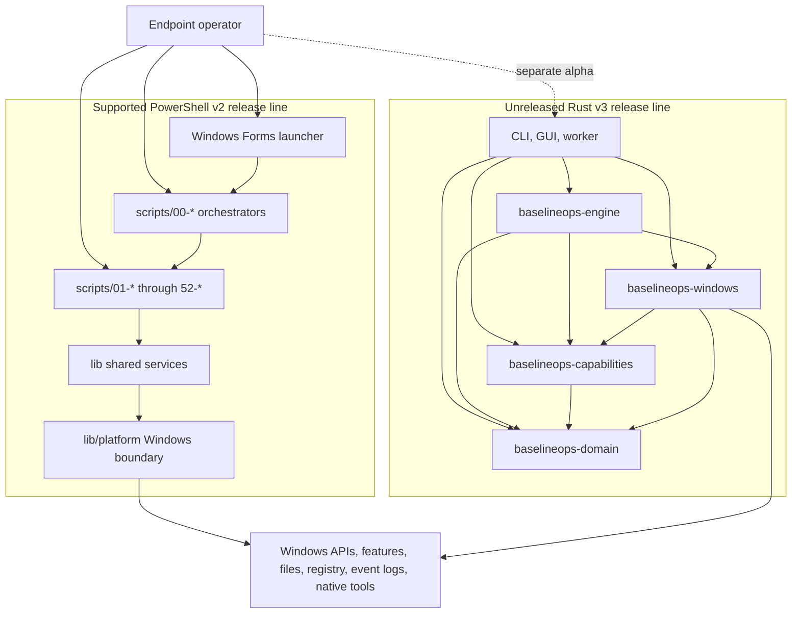
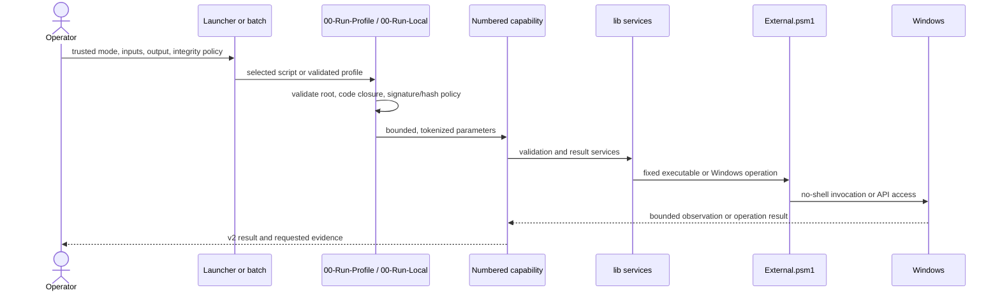

# Architecture

BaselineOps has two separate implementations for Windows endpoint management:

- the supported, file-distributed PowerShell v2 application; and
- the self-contained, unreleased Rust v3 workspace.

The PowerShell v2 application is the supported product. Rust v3 is an
unreleased rewrite. They address the same product scope and follow the same
security expectations, but they do not share runtime code, schemas, packages,
verification evidence, or release tags. PowerShell remains the reference for
expected behavior. Rust v3 cannot claim parity until its capability ledger and
Windows evidence are complete. [ADR 0001](decisions/0001-single-runtime.md)
records this separation.

## PowerShell v2 components

- `scripts/00-*` handles orchestration: selection, profile validation,
  dependency order, integrity policy, confirmation, aggregation, and process
  exit status.
- `scripts/01-*` through `scripts/52-*` contain the endpoint capabilities. Each
  capability owns its policy, observation, remediation, findings, and rollback.
  The numbered filenames are stable capability identifiers and public entry
  points.
- `scripts/internal/` holds helpers that belong to one capability only.
- `scripts/_lib/Bootstrap.ps1` finds the application modules for runners.
- `lib/` provides validation, configuration, execution, results,
  serialization, presentation, and other behavior shared by capabilities.
- `lib/platform/` contains private implementations for executable trust,
  process control, fixed native-tool adapters, and Windows operations.
  `lib/External.psm1` is the only public module that exposes them.
- `tools/Launcher-GUI.ps1`, `tools/Launcher-Worker.ps1`, and
  `tools/Launcher.Core.psm1` make up the shipped Windows Forms launcher. The
  other files in `tools/` verify or scaffold the repository and are not
  capability dependencies.

Dependencies flow down the list above. Shared modules never import endpoint
capabilities. Validation and side-effect rules that are specific to one
capability stay with that capability, even when another script has similar
code. This keeps each endpoint policy visible and auditable.

### Principal PowerShell flow

`00-Run-Batch.ps1` turns a curated category into a temporary profile and passes
it to the profile runner. `00-Run-Profile.ps1` validates the profile and its
dependency graph, then sends each selected capability to `00-Run-Local.ps1`.
The launcher worker uses the same public entry points and dispatches only
profile validation, one-script execution, or profile execution. When an
operator invokes a numbered capability directly, it bypasses the orchestration
layer and calls the shared services and Windows implementation itself.

Before loading its validator, the profile runner acquires a private execution
lease. The lease keeps handles open for the runner's coordination files and for
the complete `lib`, `scripts/_lib`, and `scripts/internal` code sets under both
the runner root and target root. It holds those handles until final result
serialization.

A capability runner can borrow only a registered live lease that matches its
exact canonical runner root, target root, and direct profile caller. A direct
`00-Run-Local.ps1` invocation acquires its own lease. Only the lease owner
disposes the retained handles, and cleanup is idempotent even after partial
acquisition.
The local runner still performs target-file, signature, hash, ACL, and
reparse-point checks for each selected capability. Profile data and result metadata cannot create or authorize
a lease.

## PowerShell contracts and state

The supported interface includes the 52 numbered scripts and six `00-*`
entry points; their documented parameters and help; profile version 2.0; the v2
result fields and exit codes `0`/`1`/`2`; the JSON and CSV projections; the
example input shapes; and the release ZIP layout. Within the v2 release,
`scripts/internal/`, `scripts/_lib/`, `lib/platform/`, launcher worker
arguments, and individual module functions remain implementation details.

Profiles and configuration are always untrusted data. They can describe desired
state, but they cannot grant access to arbitrary executable arguments,
privileged output paths, network endpoints, or remediation. Only trusted
operator parameters or protected deployment policy can make those choices.

The PowerShell application has no daemon, database, plugin system, or remote
control plane. It persists only capability-specific data: requested reports and
evidence, fixed ACL-checked Sysmon state under common application data,
emergency isolation rollback state, and bounded launcher logs under the current
user's temporary directory. Treat all endpoint evidence as sensitive.

## PowerShell side-effect and process boundaries

Audit mode reads endpoint state, but it may also write a report or evidence when
the operator explicitly requests one. Remediation requires trusted command
mode, administrator authority where documented, and `ShouldProcess`. Elevated
imports must pass protected-root, owner, ACL, reparse-point, signature, and
hash checks, including checks on the complete set of loaded code.

Capabilities and orchestrators launch native processes only through
`External.psm1`. This boundary resolves an exact executable, preserves every
argument token, limits output and duration, and never invokes a command shell.

The launcher has its own process-lifecycle boundary. It starts a PowerShell
worker, assigns the worker to a Windows Job Object, and then opens a readiness
gate before any repository import or dispatch. This design bounds the worker
tree and allows the launcher to terminate it. It is not OS-level suspended
process creation: PowerShell and CLR initialization happen before the Job
assignment. The guarded start therefore applies to repository code, not to the
initial PowerShell and CLR startup.

Output-path validation checks names and reparse points before a write. It does
not retain a directory handle that binds the later write to the exact
filesystem object that was validated. For this reason, privileged runs must use
protected output directories that untrusted users cannot rename, replace, or
redirect.

`RequireSigned` accepts any chain-valid Authenticode signature; by itself, it
does not pin the BaselineOps publisher. A hash supplied by a profile is an
integrity assertion from that same profile, not independent proof of a release.
Trust comes from release provenance, a protected installation, and a signer or
digest policy owned by the deployment.

Use JSON when the complete result must be preserved. CSV is a spreadsheet-safe
projection that neutralizes cells with formula-like prefixes.

## Rust v3 boundary

The Rust workspace contains domain, capability, Windows, and engine libraries.
It also contains standard-user CLI and GUI applications, a short-lived elevated
worker, and `xtask` developer/release automation. Applications compose the
engine and its supporting crates. The engine depends on domain, capabilities,
and Windows adapters. Windows adapters implement capability and domain
contracts, while capabilities depend on domain. The domain crate remains
independent of operating-system and presentation code.

Rust v3 uses typed, bounded JSON and a compile-time registry. Its workflow has
three distinct stages: audit observes state, plan creates host-bound actions
that expire, and apply uses authenticated local IPC plus a second approval bound
to the digest. Apply refuses changes while required package, UAC, journal, capability,
or Windows verification is incomplete.

See the [Rust architecture](https://github.com/sebastianspicker/baseline-ops/blob/main/rust/docs/architecture.md),
[verification contract](https://github.com/sebastianspicker/baseline-ops/blob/main/rust/docs/verification.md), and
[parity status](rust-v3.md) for the v3-specific model.

## Build and release boundaries

PowerShell `v*` releases contain the reviewed operator files and exclude
tests, workflows, Rust, and development-only files. Rust `rust-v*` releases have
their own signed binaries, schemas, examples, documentation, SBOM, manifest,
and evidence gates. Each workflow qualifies only its own release line.

`tools/verify.ps1` checks the reviewed PowerShell interface and parses and
analyzes maintained PowerShell source. Pester covers results, serialization,
runners, trust boundaries, and selected capability contracts. Rust has separate
Cargo and `xtask` gates. Portable checks do not replace verification under
Windows PowerShell 5.1, a protected workspace, LocalSystem, a signed package,
Windows features, hardware, or the manual launcher.
