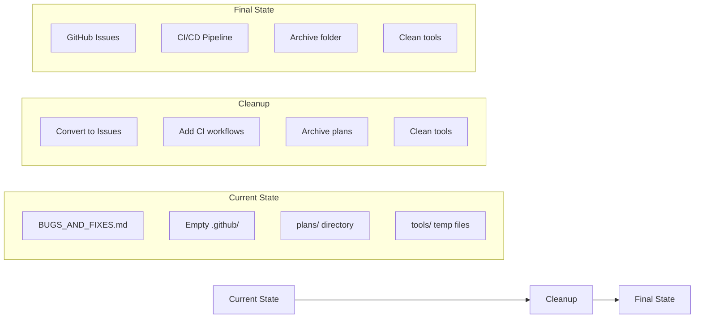
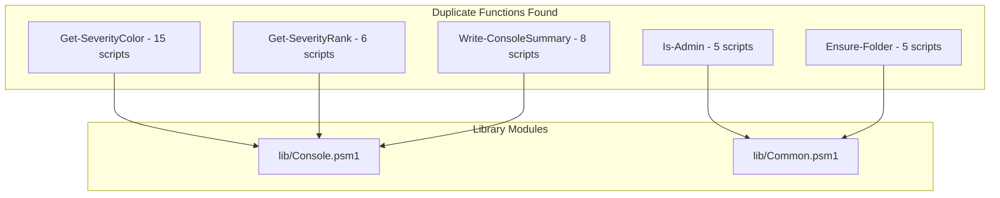

# Comprehensive Repository Improvement Plan

## Executive Summary

This plan provides a detailed roadmap for improving the Windows MDM Security Hardening Kit across eight key areas. Building on completed Phases 1-4, this plan outlines remaining work and new initiatives.

---

## Current State Analysis

### Completed Work
- ✅ Phase 1: Critical bug fixes (path traversal, audit-only violations)
- ✅ Phase 2: Library consolidation (Console.psm1, External.psm1, Registry.psm1 extensions)
- ⏳ Phase 3: Code quality (30% complete - error handling, WhatIf/Confirm)
- ⏳ Phase 4: Documentation & Testing (partially complete)

### Key Metrics
| Metric | Current | Target |
|--------|---------|--------|
| Duplicate functions | 21+ | 0 |
| Open bugs | 5 critical/high | 0 |
| Scripts using lib functions | ~30% | 100% |
| Test coverage | 3 modules | 8 modules |
| Scripts with -WhatIf | 22/45 | 45/45 |

---

## 1. Repository Cleanup

### 1.1 File Structure Cleanup



### 1.2 Tasks

| Task | Priority | Description | Files Affected |
|------|----------|-------------|----------------|
| Convert BUGS_AND_FIXES.md to GitHub Issues | High | Create individual issues for remaining 5 open bugs | BUGS_AND_FIXES.md |
| Add GitHub Actions CI workflow | High | Create .github/workflows/ci.yml for automated testing | .github/ |
| Archive completed plans | Medium | Move completed plans to plans/archive/ | plans/*.md |
| Add CHANGELOG.md | Medium | Track version history and changes | CHANGELOG.md |
| Add .editorconfig | Low | Consistent formatting across editors | .editorconfig |

### 1.3 GitHub Actions CI Workflow

```yaml
# .github/workflows/ci.yml
name: CI
on: [push, pull_request]
jobs:
  verify:
    runs-on: windows-latest
    steps:
      - uses: actions/checkout@v4
      - name: Verify Syntax
        shell: powershell
        run: .\tools\verify.ps1 -RootPath $env:GITHUB_WORKSPACE
      - name: Secret Scan
        shell: powershell
        run: .\tools\secret-scan.ps1 -RootPath $env:GITHUB_WORKSPACE
  test:
    runs-on: windows-latest
    needs: verify
    steps:
      - uses: actions/checkout@v4
      - name: Run Pester Tests
        shell: powershell
        run: Invoke-Pester -Path tests\ -Output Detailed
```

---

## 2. Remove Unnecessary Documentation and Artifacts

### 2.1 Documentation Audit

| File | Action | Reason |
|------|--------|--------|
| BUGS_AND_FIXES.md | Archive after conversion | Content moved to GitHub Issues |
| plans/implementation-plan-phases1-4.md | Archive | Completed phases |
| plans/repo-improvement-plan.md | Archive | Superseded by this plan |
| plans/github-issues.md | Keep | Reference for issue creation |
| tools/fix-error-handling.ps1 | Evaluate | One-time fix tool - document or remove |
| tools/fix-placeholders.ps1 | Evaluate | One-time fix tool - document or remove |

### 2.2 Code Artifacts to Remove

| Artifact | Location | Count | Action |
|----------|----------|-------|--------|
| Inline duplicate functions | 21 scripts | 50+ | Remove after migration to lib |
| Placeholder paths in examples | Documentation | Intentional | Keep for illustration |
| Commented-out code | 38-SecurityOptions-Drift.ps1 | 1 | Uncomment pipeline output |

---

## 3. Code Improvements

### 3.1 Remaining Bug Fixes

#### Critical/High Priority Open Issues

| ID | Bug | Impact | Fix |
|----|-----|--------|-----|
| #3 | Pipeline output commented out | Automation breaks | Uncomment object emission |
| #21 | Kill switch schtasks not validated | Incorrect success reporting | Use Invoke-Schtasks wrapper |
| #23 | Copy-Local option injection | Security risk | Validate RepoUrl/RepoRef |
| #24 | Supply-chain drift | Security risk | Verify remote URL matches |
| #25 | No integrity check before execution | Security risk | Add optional signature check |

### 3.2 Error Handling Standardization

**Current Pattern (Bad):**
```powershell
try {
  Remove-Item $path -ErrorAction SilentlyContinue
  Write-Success "Removed $path"
} catch { }
```

**Target Pattern (Good):**
```powershell
try {
  if ($PSCmdlet.ShouldProcess($path, 'Remove')) {
    Remove-Item $path -ErrorAction Stop
    Write-Success "Removed $path"
  }
} catch {
  Add-Finding -Code 'REMOVE_FAILED' -Severity 'Warning' -Message "Failed to remove $path: $($_.Exception.Message)"
}
```

### 3.3 Scripts Needing Error Handling Updates

| Script | Issues | Priority |
|--------|--------|----------|
| 21-EmergencyKillSwitch.ps1 | SilentlyContinue in rollback | High |
| 11-IOC-Sweep-Defender.ps1 | reg.exe exit codes | High |
| 16-Sysmon-Config-Updater.ps1 | wevtutil exit codes | Medium |
| 17-Sysmon-Rule-Drift-Sensor.ps1 | wecutil exit codes | Medium |
| 07-ScheduledTasks-Hygiene.ps1 | schtasks exit codes | Medium |

---

## 4. Code Deduplication

### 4.1 Duplicate Functions Analysis



### 4.2 Migration Plan

#### Phase A: Console Functions → lib/Console.psm1

| Function | Scripts to Update | Effort |
|----------|-------------------|--------|
| Get-SeverityColor | 15 scripts | Low |
| Get-SeverityRank | 6 scripts | Low |
| Get-StatusColor | 4 scripts | Low |
| Get-ConsoleColor | 3 scripts | Low |
| Write-ConsoleSummary | 8 scripts | Medium |

**Scripts Affected:**
- 08-WinGet-SelfHeal.ps1
- 13-LSASS-CG-HVCI-VBS.ps1
- 15-HardwareTPM-Audit.ps1
- 17-Sysmon-Rule-Drift-Sensor.ps1
- 18-Firewall-Baseline.ps1
- 19-Software-Audit.ps1
- 23-BitLocker-Operations-Audit.ps1
- 27-Defender-Health-Audit.ps1
- 28-Join-Identity-Audit.ps1
- 33-AdvancedAuditPolicy-Audit.ps1
- 34-TimeSync-Health.ps1
- 35-Storage-Reliability-Audit.ps1
- 36-Backup-Readiness-Audit.ps1
- 37-Remote-Surface-Audit.ps1
- 38-SecurityOptions-Drift.ps1
- 39-CredentialGuard-VBS-AuditRemediate.ps1
- 41-NTLM-Audit-Client.ps1

#### Phase B: Admin Functions → lib/Common.psm1

| Function | Scripts to Update | Effort |
|----------|-------------------|--------|
| Is-Admin | 5 scripts | Low |

**Scripts Affected:**
- 04-OfficeBrowser-Hardening-Proof.ps1
- 05-WUFB-Proofing.ps1
- 06-UpdateHealth-SSU-Proof.ps1
- 07-ScheduledTasks-Hygiene.ps1
- 09-SupportBundle.ps1

#### Phase C: Directory Functions → lib/Common.psm1

| Function | Scripts to Update | Effort |
|----------|-------------------|--------|
| Ensure-Folder | 5 scripts | Low |
| Ensure-FolderForFile | 2 scripts | Low |
| Ensure-ExportDirectory | 1 script | Low |

**Scripts Affected:**
- 10-SupportBundle-Parser.ps1
- 14-SecureRemoteAccessGuardrails.ps1
- 20-MissingPatch-Notification.ps1
- 35-Storage-Reliability-Audit.ps1
- 42-Client-SecurityBaseline-Report-IntuneRef.ps1
- 45-WEF-Client-Forwarding-Readiness-Audit.ps1

### 4.3 Migration Template

For each script, the migration follows this pattern:

```powershell
# BEFORE (inline function)
function Get-SeverityColor {
  param([string]$Severity)
  switch ($Severity) {
    'Critical' { return 'Red' }
    # ...
  }
}

# AFTER (import from lib)
# Remove inline function
# Add at top of script:
Import-Module (Join-Path $script:LibPath 'Console.psm1') -Force
```

---

## 5. Code Refactoring

### 5.1 Standard Script Template

All scripts should follow this structure:

```powershell
#requires -version 5.1
<#
.SYNOPSIS
    Brief one-line description.
.DESCRIPTION
    Detailed description of what the script does.
.PARAMETER Remediate
    If set, applies remediation instead of audit-only mode.
.PARAMETER ConfigPath
    Path to JSON configuration file.
.PARAMETER WhatIf
    Shows what would happen without making changes.
.PARAMETER Confirm
    Prompts for confirmation before making changes.
.OUTPUTS
    Description of pipeline output object.
.EXAMPLE
    .\ScriptName.ps1
    Runs in audit mode.
.EXAMPLE
    .\ScriptName.ps1 -Remediate -WhatIf
    Shows what remediation would do.
.NOTES
    Author: Organization
    Requires: Admin rights, Windows 10/11
#>

[CmdletBinding(SupportsShouldProcess = $true, ConfirmImpact = 'High')]
param(
  [switch]$Remediate,
  [string]$ConfigPath = $null,
  # ... other params
)

# Bootstrap and imports
. (Join-Path $PSScriptRoot '_lib/Bootstrap.ps1')
Import-Module (Join-Path $script:LibPath 'Output.psm1') -Force
Import-Module (Join-Path $script:LibPath 'Common.psm1') -Force
# Import only what's needed

Set-StrictMode -Version Latest
$ErrorActionPreference = 'Stop'

# Script-level variables
$script:EventSource = 'ScriptName'
$script:EventLogName = 'Application'

# Main logic
try {
  Require-Admin
  # ... script logic
} catch {
  Write-Error "Script failed: $($_.Exception.Message)"
  exit 1
}
```

### 5.2 Refactoring Tasks

| Task | Scripts | Description |
|------|---------|-------------|
| Add SupportsShouldProcess | 23 remaining | Add to all remediation scripts |
| Standardize param names | All | Use consistent -ConfigPath, -Remediate |
| Add pipeline output | 38-SecurityOptions-Drift.ps1 | Uncomment object emission |
| Remove inline functions | 21 scripts | Use lib modules instead |
| Add exit codes | All | Use consistent 0/1/2 exit codes |

### 5.3 Exit Code Standardization

```powershell
# Define at script start
$EXIT_SUCCESS = 0
$EXIT_ERROR = 1
$EXIT_PARTIAL = 2

# Use at end
if ($FailedCount -eq 0) {
  exit $EXIT_SUCCESS
} elseif ($SuccessCount -eq 0) {
  exit $EXIT_ERROR
} else {
  exit $EXIT_PARTIAL
}
```

---

## 6. Quality of Life Improvements

### 6.1 Developer Experience

| Improvement | Description | Priority |
|-------------|-------------|----------|
| Add -Verbose support | All scripts should support verbose output | High |
| Add -Quiet support | Suppress console output for automation | High |
| Improve help documentation | Ensure all scripts have complete help | Medium |
| Add script categories | Group scripts in README by function | Medium |
| Add validation scripts | Tools to validate script structure | Low |

### 6.2 Operational Improvements

| Improvement | Description | Priority |
|-------------|-------------|----------|
| Add logging options | Optional file logging for all scripts | High |
| Standardize JSON schemas | Create JSON schema files for configs | Medium |
| Add config validation | Validate configs before use | Medium |
| Add dry-run mode | Preview changes without executing | Medium |
| Add progress indicators | Show progress for long operations | Low |

### 6.3 Testing Infrastructure

| Task | Description | Priority |
|------|-------------|----------|
| Add External.Tests.ps1 | Test lib/External.psm1 | High |
| Add Config.Tests.ps1 | Test lib/Config.psm1 | High |
| Add EventLog.Tests.ps1 | Test lib/EventLog.psm1 | Medium |
| Add Results.Tests.ps1 | Test lib/Results.psm1 | Medium |
| Add integration tests | Test script parameter binding | Medium |
| Add mock data | Sample configs for testing | Low |

---

## 7. Potential New Functions

### 7.1 New Library Functions

#### lib/Validation.psm1 (NEW)

```powershell
function Test-PathTraversal {
  [CmdletBinding()]
  param([string]$Path)
  # Check for ..\ and other traversal patterns
  # Returns $true if path is safe
}

function Test-SafeScriptName {
  [CmdletBinding()]
  param([string]$Name)
  # Validate script name is safe (no path chars)
  # Returns $true if name is safe
}

function Test-ValidGitRef {
  [CmdletBinding()]
  param([string]$Ref)
  # Validate git ref format
  # Returns $true if ref is valid
}

function Test-SafeUrl {
  [CmdletBinding()]
  param([string]$Url)
  # Validate URL format and protocol
  # Returns $true if URL is safe
}
```

#### lib/Crypto.psm1 (NEW)

```powershell
function Get-FileHashSafe {
  [CmdletBinding()]
  param(
    [string]$Path,
    [ValidateSet('SHA256','SHA384','SHA512','MD5')]
    [string]$Algorithm = 'SHA256'
  )
  # Wrapper with error handling
  # Returns hash object or $null
}

function Test-FileSignature {
  [CmdletBinding()]
  param([string]$Path)
  # Get authenticode signature info
  # Returns signature status object
}

function Test-FileIntegrity {
  [CmdletBinding()]
  param(
    [string]$Path,
    [string]$ExpectedHash,
    [string]$Algorithm = 'SHA256'
  )
  # Verify file against expected hash
  # Returns $true if match
}
```

#### lib/Common.psm1 Extensions

```powershell
function Get-ScriptMetadata {
  [CmdletBinding()]
  param([string]$Path)
  # Extract version, author, etc. from script header
  # Returns metadata object
}

function Compare-ObjectDeep {
  [CmdletBinding()]
  param(
    [object]$ReferenceObject,
    [object]$DifferenceObject
  )
  # Deep object comparison for drift detection
  # Returns difference object
}

function Export-ObjectToMultipleFormats {
  [CmdletBinding()]
  param(
    [object]$Object,
    [string]$BasePath,
    [string[]]$Formats = @('JSON','CSV','XML')
  )
  # Export to multiple formats in one call
}
```

### 7.2 New Scripts

| Script | Purpose | Priority |
|--------|---------|----------|
| 46-Intune-Policy-Drift.ps1 | Compare local settings with Intune baseline | High |
| 47-EventLog-Forwarding-Test.ps1 | Test WEF connectivity | Medium |
| 48-Security-Baseline-Compare.ps1 | Compare against Microsoft baselines | Medium |
| 49-Audit-Policy-Enforce.ps1 | Enforce advanced audit policy | Medium |
| 50-Service-Hardening.ps1 | Service configuration hardening | Low |

### 7.3 New Tools

| Tool | Purpose | Priority |
|------|---------|----------|
| tools/new-script.ps1 | Generate new script from template | Medium |
| tools/validate-script.ps1 | Validate script structure | Medium |
| tools/migrate-functions.ps1 | Auto-migrate inline functions to lib | Low |
| tools/generate-docs.ps1 | Generate documentation from scripts | Low |

---

## 8. UI Improvements

### 8.1 Console Output Enhancements

| Improvement | Description | Priority |
|-------------|-------------|----------|
| Add progress bars | Show progress for long operations | Medium |
| Add color themes | Support different color schemes | Low |
| Add table formatting | Better structured output | Medium |
| Add summary dashboard | Visual summary at end | Low |

### 8.2 Output Format Options

```powershell
# Add to scripts that produce output
[ValidateSet('Console','JSON','CSV','XML','None')]
[string]$OutputFormat = 'Console'

# Example usage
param(
  [string]$OutputFormat = 'Console',
  [string]$OutputPath = $null
)

# At end of script
switch ($OutputFormat) {
  'JSON' {
    $result | ConvertTo-Json -Depth 10 | Out-File $OutputPath
  }
  'CSV' {
    $result.Findings | Export-Csv $OutputPath -NoTypeInformation
  }
  'XML' {
    $result | Export-Clixml $OutputPath
  }
  default {
    Write-ConsoleSummary -Summary $result
  }
}
```

### 8.3 Proposed Console Dashboard

```
╔═══════════════════════════════════════════════════════════════════╗
║              SECURITY HARDENING AUDIT SUMMARY                     ║
╠═══════════════════════════════════════════════════════════════════╣
║ Computer: WIN11-WS01           Timestamp: 2026-02-24 11:25:00    ║
╠═══════════════════════════════════════════════════════════════════╣
║ FINDINGS BY SEVERITY                                              ║
║ ┌─────────┬───────┬─────────────────────────────────────────────┐ ║
║ │ Critical│   2   │ ████████████████████                        │ ║
║ │ High    │   5   │ ████████████████████████████████████████    │ ║
║ │ Medium  │   8   │ ███████████████████████████████████████████ │ ║
║ │ Low     │   3   │ ████████████                                │ ║
║ │ Info    │  12   │ ████████████████████████████████████████████│ ║
║ └─────────┴───────┴─────────────────────────────────────────────┘ ║
╠═══════════════════════════════════════════════════════════════════╣
║ STATUS: ⚠️ DRIFT DETECTED - 30 findings require attention         ║
╚═══════════════════════════════════════════════════════════════════╝
```

---

## 9. Implementation Phases

### Phase 5: Bug Fixes & Security (Priority: Critical)

| Task | Description | Effort |
|------|-------------|--------|
| Fix pipeline output | Uncomment in 38-SecurityOptions-Drift.ps1 | Low |
| Fix kill switch validation | Use Invoke-Schtasks wrapper | Medium |
| Fix Copy-Local validation | Add URL/ref validation | Medium |
| Fix supply-chain drift | Verify remote URL | Medium |
| Add integrity check | Optional signature check | Medium |

### Phase 6: Code Deduplication (Priority: High)

| Task | Description | Effort |
|------|-------------|--------|
| Migrate console functions | 21 scripts → lib/Console.psm1 | High |
| Migrate admin functions | 5 scripts → lib/Common.psm1 | Low |
| Migrate directory functions | 6 scripts → lib/Common.psm1 | Low |
| Remove inline duplicates | Clean up migrated scripts | Medium |

### Phase 7: Code Quality (Priority: High)

| Task | Description | Effort |
|------|-------------|--------|
| Add SupportsShouldProcess | 23 remaining scripts | Medium |
| Standardize error handling | All scripts | High |
| Add exit codes | All scripts | Low |
| Standardize param names | All scripts | Medium |

### Phase 8: Testing & Documentation (Priority: Medium)

| Task | Description | Effort |
|------|-------------|--------|
| Add External.Tests.ps1 | Test lib/External.psm1 | Medium |
| Add Config.Tests.ps1 | Test lib/Config.psm1 | Low |
| Add EventLog.Tests.ps1 | Test lib/EventLog.psm1 | Low |
| Add Results.Tests.ps1 | Test lib/Results.psm1 | Low |
| Create GitHub Actions CI | Automated testing | Medium |
| Archive completed plans | Clean up plans/ | Low |

### Phase 9: New Features (Priority: Low)

| Task | Description | Effort |
|------|-------------|--------|
| Create lib/Validation.psm1 | New validation functions | Medium |
| Create lib/Crypto.psm1 | New crypto functions | Medium |
| Create new scripts | 5 proposed new scripts | High |
| Create new tools | 4 proposed new tools | Medium |

### Phase 10: UI Enhancements (Priority: Low)

| Task | Description | Effort |
|------|-------------|--------|
| Add progress bars | Long operations | Medium |
| Add output formats | JSON/CSV/XML options | Medium |
| Add console dashboard | Visual summary | Medium |
| Add color themes | Different schemes | Low |

---

## 10. Architecture Diagram

```mermaid
graph TB
    subgraph Library Layer
        Common[Common.psm1<br/>Admin, Path helpers]
        Output[Output.psm1<br/>Console output]
        Registry[Registry.psm1<br/>Registry operations]
        Config[Config.psm1<br/>Config loading]
        EventLog[EventLog.psm1<br/>Event logging]
        Results[Results.psm1<br/>Findings management]
        Console[Console.psm1<br/>Severity, Summary]
        External[External.psm1<br/>Native commands]
        Validation[Validation.psm1<br/>NEW: Input validation]
        Crypto[Crypto.psm1<br/>NEW: Hash, Signature]
    end

    subgraph Script Categories
        Audit[Audit Scripts<br/>20+ scripts]
        Remediate[Remediation Scripts<br/>15+ scripts]
        Collection[Collection Scripts<br/>5+ scripts]
        Utility[Utility Scripts<br/>5+ scripts]
    end

    subgraph Infrastructure
        Bootstrap[_lib/Bootstrap.ps1]
        Tests[tests/<br/>Pester tests]
        Tools[tools/<br/>Dev utilities]
        CI[.github/workflows/<br/>CI/CD]
    end

    subgraph Configuration
        Examples[examples/configs/<br/>Sample configs]
        Schemas[JSON Schemas<br/>NEW]
    end

    Audit --> Common
    Audit --> Output
    Audit --> Console
    Audit --> Results
    Audit --> Validation

    Remediate --> Common
    Remediate --> Registry
    Remediate --> External
    Remediate --> EventLog
    Remediate --> Crypto

    Collection --> Common
    Collection --> Output
    Collection --> External

    Utility --> Common
    Utility --> Config
    Utility --> Validation

    Bootstrap --> Library Layer
    Tests --> Library Layer
    CI --> Tests
    CI --> Tools
```

---

## 11. Risk Assessment

| Risk | Likelihood | Impact | Mitigation |
|------|------------|--------|------------|
| Breaking changes in lib modules | Medium | High | Version modules, deprecation warnings |
| Scripts fail after deduplication | Medium | High | Comprehensive testing before merge |
| New bugs introduced | Medium | Medium | Add tests, code review |
| Scope creep | High | Medium | Stick to phased approach |
| CI/CD pipeline issues | Low | Medium | Test locally first |

---

## 12. Success Criteria

| Metric | Current | Phase 5-6 | Phase 7-8 | Final |
|--------|---------|-----------|-----------|-------|
| Open critical/high bugs | 5 | 0 | 0 | 0 |
| Duplicate functions | 21+ | 0 | 0 | 0 |
| Scripts with -WhatIf | 22/45 | 30/45 | 45/45 | 45/45 |
| Test coverage | 3 modules | 5 modules | 8 modules | 8 modules |
| Scripts using lib | 30% | 60% | 100% | 100% |
| CI/CD | None | Basic | Full | Full |

---

## Next Steps

1. **Review this plan** and prioritize phases
2. **Create GitHub Issues** for remaining bugs
3. **Begin Phase 5** with critical bug fixes
4. **Set up CI/CD** for automated testing
5. **Execute deduplication** systematically

---

## Questions for User

1. Should we prioritize security fixes (Phase 5) or code deduplication (Phase 6) first?
2. Are there specific scripts that need immediate attention?
3. Should we add GitHub Actions CI now or after more testing?
4. Are there additional new functions or scripts you'd like to see?
5. What UI improvements are most important to you?
